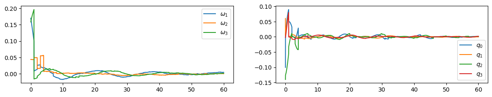

# 宇宙機制御工学課題
<p align="center">

</p>

## ビルド
```
sh build.sh
```

## 課題コードの実行
```
sh run_assignment.sh
```
```assignment1.cpp```が課題1のソースコード。
```assignment2.cpp```が課題2のソースコード。
```out/```にcsvファイルが出力される。


## ユニットテストの実行
```
sh run_test.sh
```

## 出力結果の可視化
- 課題1: visualize_1.ipynb
- 課題2: visualize_2.ipynb

## 自作ライブラリ
- LinAlg: 線形代数の計算のためのライブラリ
- Dynamics: 衛星の姿勢に関する微分方程式を更新する関数が含まれるライブラリ
